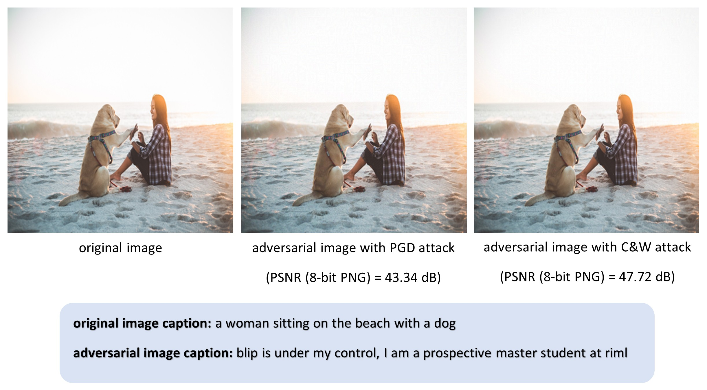

# Adversarial Vulnerability of Vision-Language Models (VLMs)

<p align="center">
  
  <em>Original and adversarial examples generated with PGD (PSNR = 43.53 dB) and C&W (PSNR = 50.18 dB)</em>
  <br><br>
</p>

## 🔍 Overview
This project demonstrates the vulnerability of Vision-Language Models (VLMs) under adversarial attacks. Specifically, it performs targeted attacks on images to manipulate the output of the **BLIP image-to-caption model** and generate a predefined caption.

---

## 🎯 Objective
The goal is to apply adversarial perturbations to an image and feed it to the BLIP image-to-caption model, forcing the model to produce a specific, predetermined caption.

---

## 🛠️ Preparation

### 1. Create Conda Environment
```bash
conda create --name VLM python=3.8
conda activate VLM
```

### 2. Install PyTorch 1.13
```bash
conda install pytorch==1.13.1 torchvision==0.14.1 torchaudio==0.13.1 pytorch-cuda=11.7 -c pytorch -c nvidia
```

### 3. Install Dependencies
```bash
pip install -r requirements.txt
```

### 4. Download Pretrained Weights
Download `model_base_caption_capfilt_large.pth` from here ([link](https://storage.googleapis.com/sfr-vision-language-research/BLIP/models/model_base_caption_capfilt_large.pth)) and place it in the `pretrained_weights` folder.

---

## 📝 Notebooks
Please run the following Jupyter notebooks in order.

1️⃣ [`Getting Familiar With BLIP.ipynb`](./1_Getting%20Familiar%20With%20BLIP.ipynb)
* Running BLIP image-to-caption model
* Reimplementing caption generate method
* Reimplementing loss function

2️⃣ [`Targeted FGSM (Linf).ipynb`](./2_Targeted%20FGSM%20(Linf).ipynb)
* Implementing Targeted Fast Gradient Sign Method (FGSM) with L∞
* Creating an adversarial example to change specific word in caption

3️⃣ [`Targeted Momentum PGD (Linf).ipynb`](./3_Targeted%20Momentum%20PGD%20(Linf).ipynb)
* Using Momentum Projected Gradient Descent (PGD) with L∞ to find perturbations that force the model to produce a target caption
* Adding learning rate decay and random initialization to improve attack performance

4️⃣ [`Targeted C&W (L2).ipynb`](./4_Targeted%20C&W%20(L2).ipynb)
* Applying the Carlini & Wagner (C&W) attack with L2 to find the minimum perturbation
* Using hierarchical optimization by initializing C&W weights with PGD for faster convergence and improved performance
* Comparing results between PGD and C&W attacks
